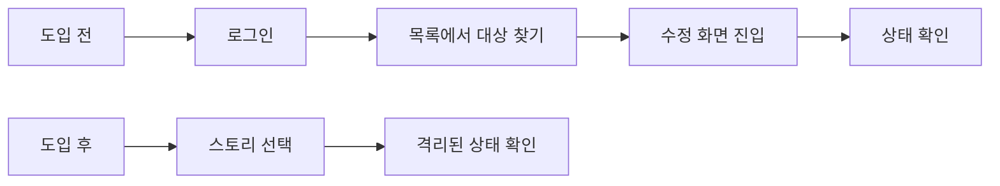
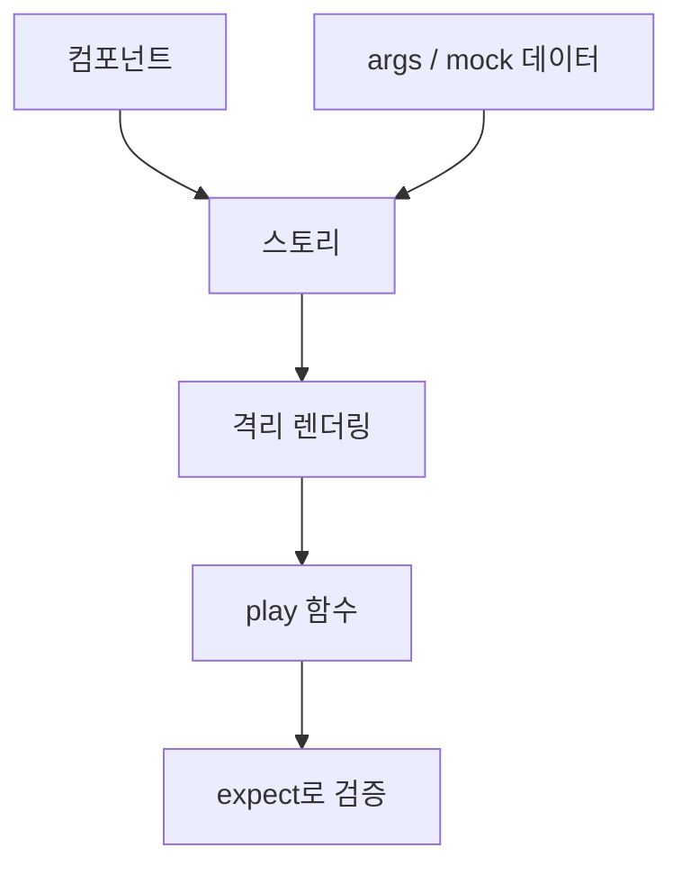
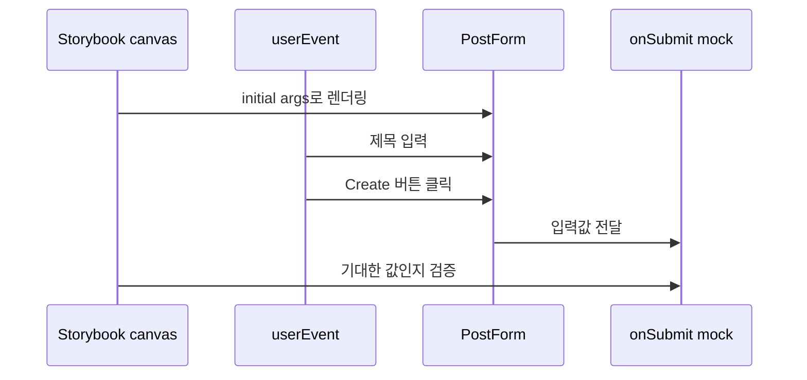
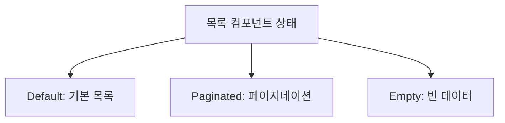
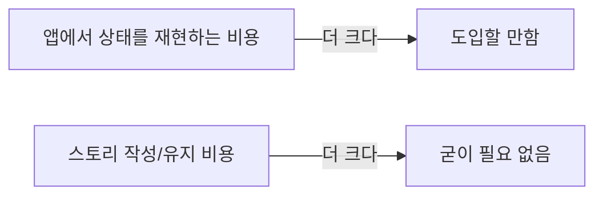

Next.js로 만든 개인 블로그(웹 + 어드민 모노레포)에 Storybook을 도입하고, 컴포넌트 스토리와 play 함수 기반 인터랙션 테스트를 작성했어요. 이 글을 읽으면 개인이나 소규모 프로젝트에서 Storybook 도입이 남는 장사인지 판단할 수 있어요. 결론부터 말하면, **상태가 많은 폼 컴포넌트에서는 확실히 이득이었지만, 혼자 하는 프로젝트에서는 디자이너나 팀원과 컴포넌트를 공유하고 재사용하는 협업 가치는 거의 얻기 어렵다**는 것이 제 경험이에요.

## 이 글을 읽기 전에

이 글에서 말하는 Storybook은 **컴포넌트 전시 도구**에만 머물지 않아요. 저는 다음 세 가지 역할을 묶어서 Storybook이라고 부르고 있어요.

| 용어            | 이 글에서의 의미                                                |
| --------------- | --------------------------------------------------------------- |
| 스토리          | 컴포넌트를 특정 props와 상태로 렌더링하는 예시                  |
| play 함수       | 스토리가 렌더링된 뒤 사용자 행동을 흉내 내는 테스트 스크립트    |
| 인터랙션 테스트 | play 함수로 입력, 클릭, 검증을 실행하는 컴포넌트 단위 UI 테스트 |

따라서 이 글은 Storybook을 처음 설치하는 튜토리얼이 아니라, **이미 Next.js 컴포넌트를 만들고 있고 "이 정도 프로젝트에도 Storybook 테스트가 필요한가?"를 고민하는 사람**을 위한 회고예요. React 컴포넌트, props, 테스트에서의 `expect` 개념을 알고 있으면 더 쉽게 읽을 수 있어요.

## 도입 배경 — 어떤 문제가 있었는가

이 개발 블로그 프로젝트는 글을 보여주는 `web`과 글을 작성·관리하는 `admin`, 두 개의 Next.js 앱으로 이루어져 있어요. 문제는 어드민 쪽 컴포넌트를 확인하는 과정이었어요. 글 수정 폼(`PostForm`)의 "수정 모드" UI를 확인하려면 매번 이렇게 해야 했어요.

1. 어드민 dev 서버를 띄우고 로그인한다
2. 글 목록에서 수정할 글을 찾아 들어간다
3. 폼에 초기값이 채워진 상태를 눈으로 확인한다

CSS 한 줄을 고칠 때마다 이 과정을 반복하는 건 비효율적이었고, 빈 목록일 때 화면처럼 데이터 상태에 의존하는 UI는 재현 자체가 번거로웠어요.



그래서 Storybook을 도입했어요. Storybook은 컴포넌트를 실제 앱에서 분리해 독립적으로 렌더링하고, 다양한 상태를 "스토리"라는 단위로 저장해두고 확인할 수 있는 도구예요. 최근 버전에서는 단순 확인을 넘어 인터랙션 테스트까지 스토리 안에서 실행할 수 있어요.

핵심 원리는 단순해요. 앱 전체를 띄운 뒤 원하는 화면까지 이동하는 대신, 컴포넌트가 필요로 하는 입력값을 스토리에 고정해두고 그 상태만 바로 렌더링해요. 여기에 play 함수를 붙이면 "그 상태에서 사용자가 실제로 행동했을 때도 기대대로 동작하는가"까지 확인할 수 있어요.



## 무엇을 어떻게 구성했는가

### 설정 요약

- **Storybook 10.x + `@storybook/nextjs-vite`**: Next.js 16 프로젝트지만 Storybook 자체는 Vite 빌더로 돌아가요. 기동이 빠른 것이 장점이에요.
- **모노레포 구성**: `apps/web`과 `apps/admin` 각각에 `.storybook` 디렉토리를 두고, 서로 다른 포트(6006 / 6007)로 실행해요.
- **애드온**: `addon-vitest`(스토리를 테스트로 실행), `addon-a11y`(접근성 검사), `addon-docs`, Chromatic 연동용 애드온을 추가했어요.
- **테스트 실행**: `pnpm test-storybook`을 실행하면 Vitest가 Playwright 브라우저에서 스토리를 돌려요. 스토리 파일이 곧 테스트 파일이에요.

구조는 앱별 Storybook을 분리하는 방식으로 잡았어요.

```text
apps/
  web/
    .storybook/
    src/components/**/*.stories.tsx
  admin/
    .storybook/
    src/components/**/*.stories.tsx
```

처음에는 루트에 Storybook 하나만 두는 방식도 생각했지만, `web`과 `admin`은 실행 환경과 컴포넌트 의존성이 달라요. 그래서 설정은 조금 중복되더라도 앱 단위로 분리하는 편이 예측 가능하다고 판단했어요.

### 대표 예시 — PostForm 스토리

글 작성/수정 폼인 `PostForm`의 스토리가 도입 효과를 가장 잘 보여줘요. 생성 모드와 수정 모드를 각각의 스토리로 분리했어요.

```tsx
export const Create: Story = {};

export const Edit: Story = {
  args: {
    slug: "nextjs-14-guide",
    submitLabel: "Save",
    initialValues: {
      title: "Next.js 14 App Router Guide",
      content: "## Hello World",
      tags: "react, nextjs",
      published: true,
    },
  },
};
```

이렇게 나누면 Storybook 사이드바에서 `Create`와 `Edit`을 전환하는 것만으로 생성/수정 상태를 비교할 수 있어요.

| 스토리   | 확인하려는 상태          | 실제 앱에서 재현하려면                       |
| -------- | ------------------------ | -------------------------------------------- |
| `Create` | 빈 폼, 기본 제출 버튼    | 새 글 작성 화면 진입                         |
| `Edit`   | 기존 값이 채워진 수정 폼 | 로그인 후 글 목록에서 특정 글 수정 화면 진입 |

여기서 한 발 더 나아가, play 함수로 **폼을 채우고 제출하면 입력한 값이 그대로 전달되는가**까지 검증했어요. play 함수는 스토리가 렌더링된 뒤 실행되는 스크립트로, 실제 사용자처럼 타이핑하고 클릭한 다음 결과를 단언(assert)할 수 있어요.

```tsx
export const SubmitsFilledValues: Story = {
  play: async ({ canvasElement, args }) => {
    const canvas = within(canvasElement);

    await userEvent.type(
      canvas.getByPlaceholderText("Next.js 14 App Router Guide"),
      "My First Post",
    );
    await userEvent.click(canvas.getByRole("button", { name: "Create" }));

    await expect(args.onSubmit).toHaveBeenCalledWith(
      expect.objectContaining({ title: "My First Post" }),
    );
  },
};
```

play 함수가 하는 일은 아래처럼 읽을 수 있어요.



다만 이 테스트는 브라우저 안에서 컴포넌트가 기대대로 반응하는지 확인하는 범위에 머물러요. 서버 액션, DB 저장, 인증 흐름까지 보장하는 테스트는 아니기 때문에 **E2E 테스트를 완전히 대체한다고 보기는 어려워요.**

## 이점 — 도입해서 얻은 것

### 격리된 상태 재현

가장 즉각적인 효과예요. 로그인도, 라우팅도, 시드 데이터도 없이 사이드바에서 스토리를 클릭하면 원하는 상태가 바로 떠요. 알고리즘 문제 목록 컴포넌트의 경우 `Default`(5개), `Paginated`(15개, 페이지네이션 동작), `Empty`(빈 목록) 세 가지 상태를 스토리로 만들어 뒀는데, 특히 `Empty` 같은 상태는 실제 앱에서는 데이터를 지워야만 볼 수 있던 화면이에요.



코드로 보면 더 단순해요. 실제 앱에서는 빈 목록 상태를 보려고 데이터를 지우거나 API 응답을 조작해야 하지만, Storybook에서는 `posts`를 빈 배열로 넘기는 스토리 하나면 끝나요.

```tsx
export const Default: Story = {
  args: { posts: makePosts(5) },
};

export const Paginated: Story = {
  args: { posts: makePosts(15) },
};

export const Empty: Story = {
  args: { posts: [] },
};
```

이 지점에서 Storybook의 가치는 **예쁜 컴포넌트 카탈로그**보다 **상태를 고정하는 장치**에 가까웠어요. 특히 빈 상태, 에러 상태, 로딩 상태처럼 실제 서비스 데이터에 의존하는 화면일수록 효과가 컸어요.

### 테스트를 겸하는 문서

처음에는 스토리를 단순히 "컴포넌트를 띄워보는 화면" 정도로 생각했어요. 그런데 써보니 스토리 파일은 컴포넌트 사용법을 보여주는 문서 역할도 했어요. 예를 들어 검색 필터링 스토리(`FiltersBySearch`)를 보면 다음 정보를 한 번에 알 수 있어요.

1. 목록 컴포넌트에 어떤 데이터가 들어가는지
2. 검색창에 어떤 값을 입력하는지
3. 검색 후 화면에 어떤 결과가 남아야 하는지

즉 `FiltersBySearch`는 "검색어를 입력하면 결과가 1건으로 줄어든다"는 요구사항을 코드로 적어둔 문서예요. 동시에 play 함수가 그 동작을 실제로 실행하고 검증하므로 테스트이기도 해요. 사람이 읽으면 사용 예시가 되고, 테스트 러너가 실행하면 검증 코드가 되는 셈이에요.

```tsx
export const FiltersBySearch: Story = {
  args: { posts: makePosts(5) },
  play: async ({ canvasElement }) => {
    const canvas = within(canvasElement);

    await userEvent.type(
      canvas.getByPlaceholderText("Search by title, tags, difficulty..."),
      "Problem 1",
    );

    await expect(canvas.getByText("1 results found")).toBeInTheDocument();
  },
};
```

| 하나의 스토리가 맡는 역할 | 예시                                                                    |
| ------------------------- | ----------------------------------------------------------------------- |
| 문서                      | "검색 가능한 목록 컴포넌트는 이런 데이터와 props로 사용한다"를 보여준다 |
| 개발 환경                 | Storybook에서 검색 전후 화면을 바로 확인한다                            |
| 테스트                    | play 함수가 검색어를 입력하고 결과 개수를 검증한다                      |

일반 테스트 파일만 있었다면 "이 컴포넌트를 어떤 상태로 보여줄 수 있는지"를 눈으로 확인하기는 어려웠을 거예요. 반대로 화면만 있었다면 검색 동작이 계속 정상인지 자동으로 확인할 수 없었을 거예요. Storybook 스토리는 이 둘을 같은 파일에 묶어줘서, 문서와 테스트가 따로 낡아가는 문제를 줄여줬어요.

반대로 말하면 스토리 파일이 부실하면 이 장점도 줄어들어요. 스토리 이름이 모호하거나 args가 실제 사용 상황과 다르면, 문서로도 애매하고 테스트로도 신뢰하기 어려워져요.

### 컴포넌트 설계를 개선하는 압력

예상하지 못했던 이점이에요. 스토리를 쓰려면 컴포넌트가 앱 바깥에서 렌더링 가능해야 해요. 즉 서버 액션이나 전역 상태에 직접 붙어 있으면 스토리를 만들 수 없어요. `PostForm`의 경우 제출 로직을 `onSubmit` prop으로 주입받는 구조로 정리하게 됐고, 스토리에서는 `fn()`(목 함수)을 넘겨 호출 여부를 검증해요. Storybook이 강제한 이 구조 덕분에 컴포넌트와 데이터 계층의 결합도가 자연스럽게 낮아졌어요.

## 단점 — 도입하며 치른 비용

### 초기 설정 비용

Next.js 16과 App Router 조합에서 설정이 한 번에 끝나지는 않았어요. (TBD: 실제 부딪힌 이슈 — 예: 모노레포에서 패키지 경로 해석 문제, next/font 관련 에러 등 겪은 것 구체적으로) 모노레포라서 web과 admin 두 앱에 같은 설정을 각각 해줘야 했던 것도 비용이었어요. 총 소요 시간: (TBD)

### 유지보수라는 이중 작업

컴포넌트의 props가 바뀌면 스토리도 함께 고쳐야 해요. 컴포넌트 3개에 스토리를 붙인 지금은 부담이 크지 않지만, 스토리가 수십 개가 되면 **컴포넌트 수정 = 스토리 수정**이라는 세금이 계속 붙어요. 스토리가 곧 테스트이기 때문에 방치하면 CI가 깨져서 강제로 관리되는 건 장점이자 단점이에요.

### 혼자 쓰기에는 줄어드는 공유 가치

Storybook의 가장 큰 가치 중 하나는 **공유**예요. 디자이너가 구현된 컴포넌트를 확인하고, 팀원이 기존 컴포넌트를 검색해서 재사용하는 것. 혼자 개발하는 프로젝트에서는 이 가치가 통째로 사라져요. 남는 것은 개발 환경과 테스트 러너로서의 가치인데, 이것만으로 도입을 정당화할 수 있는지가 개인 프로젝트에서의 핵심 질문이에요.

### 의존성과 빌드 무게

Storybook 본체와 애드온, Vitest, Playwright까지 devDependencies가 큰 폭으로 늘었어요. 느낌만으로 말하지 않으려고 실제로 측정해봤어요. Storybook을 도입한 커밋 직전과 현재의 `package.json` + `pnpm-lock.yaml`을 각각 새 디렉터리에 두고, pnpm 스토어 캐시를 예열한 상태에서 `node_modules`를 지운 뒤 다시 설치하는 시간을 쟀어요. 용량은 junction(링크)을 제외한 실제 파일 크기 기준이에요.

| 항목                          | 도입 전 | 도입 후 | 차이           |
| ----------------------------- | ------- | ------- | -------------- |
| `node_modules` 용량           | 551 MB  | 669 MB  | +118 MB (+21%) |
| 설치되는 패키지 수            | 552개   | 726개   | +174개         |
| `pnpm install` 시간 (웜 캐시) | 16.8초  | 17.5초  | +0.7초         |

용량은 21% 늘었지만, pnpm이 전역 스토어에서 하드링크로 설치하는 덕분에 **설치 시간 차이는 사실상 없었어요.** 걱정했던 "무거워진다"는 비용이 적어도 설치 단계에서는 체감되지 않는 수준이에요. 다만 두 가지는 이 표에 포함되지 않아요. 인터랙션 테스트에 쓰는 Playwright 브라우저 바이너리는 `node_modules` 바깥에 별도로 설치되고, 콜드 캐시(스토어가 빈 상태)에서의 첫 설치는 이보다 오래 걸려요.

## 판단 — 언제 도입할 만한가

결국 판단 기준은 "컴포넌트 상태를 재현하는 비용"과 "스토리를 유지보수하는 비용"의 비교예요.



제 결론은 이래요.

**도입할 만한 경우**

- 폼처럼 상태 조합이 많은 컴포넌트가 있다 (생성/수정 모드, 로딩, 에러, 빈 상태...)
- 실제 앱에서 재현하기 번거로운 상태(로그인 뒤, 빈 데이터 등)를 자주 확인해야 한다
- 컴포넌트 단위 테스트를 어차피 작성할 계획이다 — 스토리를 작성하면 테스트와 문서까지 얻는다

**굳이 필요 없는 경우**

- 페이지가 대부분 정적이고 상태 분기가 적다
- 컴포넌트 수가 적어 앱을 직접 띄워 확인하는 비용이 낮다
- 설정과 유지보수에 쓸 시간이 컴포넌트 개발 시간보다 아깝다

이 블로그의 경우, 어드민의 폼 컴포넌트들 덕분에 손익분기는 넘겼다고 판단해요. 다만 이 판단은 "Storybook을 팀 협업 도구로 잘 썼다"는 뜻은 아니에요. 혼자 쓰는 프로젝트에서는 공유 가치가 줄어들기 때문에, 제가 실제로 얻은 가치는 **상태 재현 비용 감소, 스토리 기반 문서화, 인터랙션 테스트**에 더 가까웠어요.

다음 단계로는 Chromatic을 연동해 시각적 회귀 테스트(visual regression test)를 CI에 붙여볼 계획이에요. 그때는 "혼자 쓰는 Storybook"의 가치가 한 단계 더 올라갈지 다시 정리해볼게요.
